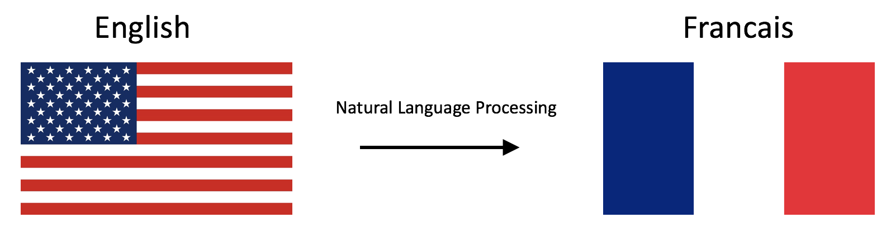

# Machine-Translation-NLP
Implemented Naive Machine Translation system with K-NN

# Translations

 Figure 2 

Program that translates English words to French words using word embeddings and vector space models. 

## Translation as linear transformation of embeddings

Given dictionaries of English and French word embeddings you will create a transformation matrix `R`
* Given an English word embedding, $\mathbf{e}$, you can multiply $\mathbf{eR}$ to get a new word embedding $\mathbf{f}$.
    * Both $\mathbf{e}$ and $\mathbf{f}$ are [row vectors](https://en.wikipedia.org/wiki/Row_and_column_vectors).
* You can then compute the nearest neighbors to `f` in the french embeddings and recommend the word that is most similar to the transformed word embedding.
